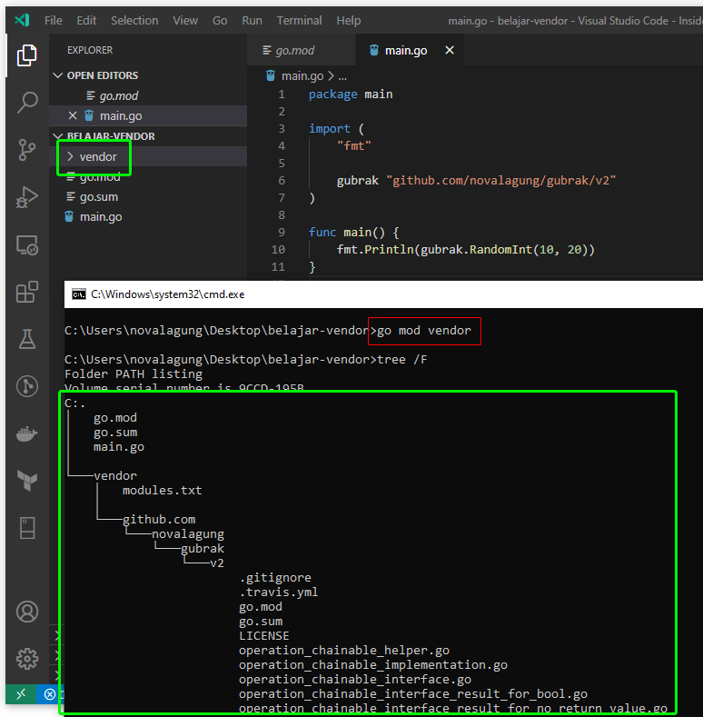

# A.61. Go Vendoring

Pada bagian ini kita akan belajar cara pemanfaatan vendoring untuk menyimpan dependensi di lokal.

## A.61.1. Penjelasan

Vendoring di Go merupakan kapabilitas untuk mengunduh semua dependency atau *3rd party*, untuk disimpan di lokal dalam folder project, dalam folder bernama `vendor`.

Dengan adanya folder tersebut, maka Go tidak akan *lookup* 3rd party ke cache folder, melainkan langsung mempergunakan yang ada dalam folder `vendor`. Jadi tidak perlu download lagi dari internet.

Ok lanjut.

## A.61.2. Praktek Vendoring

Kita akan coba praktekan untuk vendoring sebuah 3rd party bernama [gubrak](https://github.com/novalagung/gubrak/v2).

Buat folder project baru dengan nama `belajar-vendor` dengan isi satu file `main.go`. Lalu go get library gubrak.

```bash
mkdir belajar-vendor
cd belajar-vendor
go mod init belajar-vendor
go get -u github.com/novalagung/gubrak/v2
```

Isi `main.go` dengan blok kode berikut, untuk menampilkan angka random dengan range 10-20.

```go
package main

import (
	"fmt"
	gubrak "github.com/novalagung/gubrak/v2"
)

func main() {
	fmt.Println(gubrak.RandomInt(10, 20))
}
```

Setelah itu jalankan command `go mod vendor` untuk vendoring *3rd party library* yang dipergunakan, dalam contoh ini adlah gubrak.



Bisa dilihat, sekarang library gubrak *source code*-nya disimpan dalam folder `vendor`. Nah ini juga akan berlaku untuk semua *library* lainnya yg digunakan jika ada.

## A.61.3 Build dan Run Project yang Menerapkan Vendoring

Untuk membuat proses build lookup ke folder vendor, kita tidak perlu melakukan apa-apa, setidaknya jika versi Go yang diinstall adalah 1.14 ke atas. Maka command build maupun run masih sama.

```
go run main.go
go build -o executable
```

Untuk yg menggunakan versi Go di bawah 1.14, penulis sarankan untuk upgrade. Atau bisa gunakan flag `-mod=vendor` untuk memaksa Go lookup ke folder `vendor`.

```
go run -mod=vendor main.go
go build -mod=vendor -o executable
```

## A.61.3. Manfaat Vendoring

Manfaat vendoring adalah pada sisi kompatibilitas dan kestabilan 3rd party. Jadi dengan vendor, misal 3rd party yang kita gunakan di itu ada update yg sifatnya tidak *backward compatible*, maka aplikasi kita tetap aman karena menggunakan yang ada dalam folder `vendor`.

Jika tidak menggunakan vendoring, maka bisa saja saat `go mod tidy` sukses, namun sewaktu build error, karena ada fungsi yg tidak kompatibel lagi misalnya.

Untuk penggunaan vendor apakah wajib? menurut saya tidak. Sesuaikan kebutuhan saja.

---

<div class="source-code-link">
    <div class="source-code-link-message">Source code praktek chapter ini tersedia di Github</div>
    <a href="https://github.com/novalagung/dasarpemrogramangolang-example/tree/master/chapter-A.61-go-vendoring">https://github.com/novalagung/dasarpemrogramangolang-example/.../chapter-A.61...</a>
</div>

---

<iframe src="https://novalagung.substack.com/embed" width="100%" height="320" class="substack-embed" frameborder="0" scrolling="no"></iframe>
